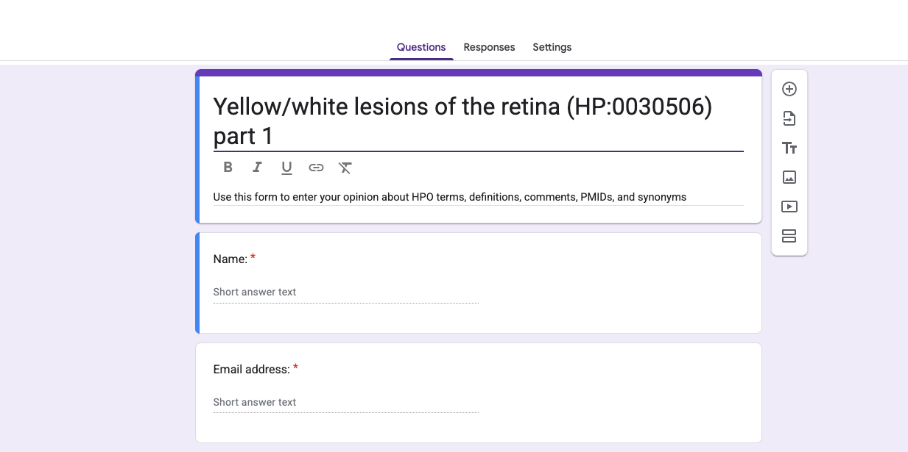
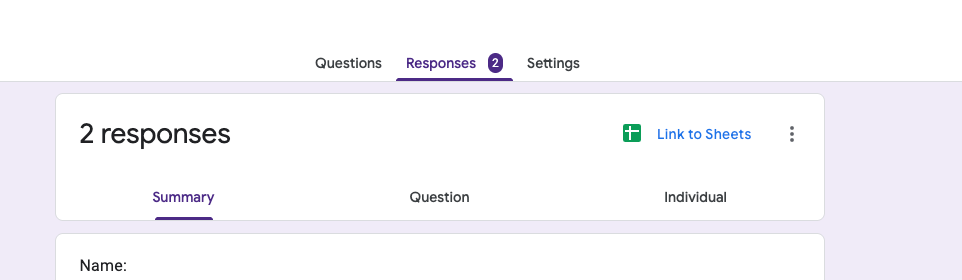

# Google Apps
hpo2gforms creates Google App scripts that automate the creation of the Google Forms that we will use for creating the
online questionnaires. There are several steps.


### Open the Google Apps Scripting Window
Open a google form in Google. Go to the ellipsis (three dots) on the upper right and open the scripting console.

<figure markdown>
{ width="600" }
<figcaption>Opening the Google Apps Scripting Window.
</figcaption>
</figure>

### Add hpo2gforms-generated script

Run the hpo2gforms application as explained [here](hpo2gforms.md). If you use this command
```bash
$ java -jar target/hpo2gforms.jar gforms -t 0000758 
```
the we expect to find new output files of the form
```bash
HP_0030506_1.txt
HP_0030506_2.txt
(...)
```
Each file needs to be pasted into a separate window and will create a separate questionnaire/form.
This is what the Google Scripting App window should look like after you have pasted in a script.


<figure markdown>
{ width="600" }
<figcaption>Replace the entire contents of the scripting window with the code generated by hpo2gforms.
</figcaption>
</figure>

### Create the questionnaire
Rename the file from "Untitled project" to a recognizable name.
In the Google environment, save the code. 

<figure markdown>
{ width="300" }
<figcaption>Saving the script.
</figcaption>
</figure>


If there are no syntax errors,
the run button will be activated. Click it. It may take a few minutes for
the Google form to be generated. You may need to grant permission for the script to run.

<figure markdown>
{ width="300" }
<figcaption>Running the script.
</figcaption>
</figure>

When the script is finished, if things have gone well, you will see "Execution completed" in the Execution Log pane at the bottom of the window.

### The created form

To find the created form, one can use the "Recent" button in one's 
Google Drive account. The title of the form is determined by the title in the script. In our example, we have
```bash
var form = FormApp.create('Yellow/white lesions of the retina (HP:0030506) part 1');
```
Using the "Recent" button in Google Drive, the top file is called "Yellow/white lesions of the retina (HP:0030506) part 1".

<figure markdown>
{ width="600" }
<figcaption>The top of the Google form created by the script.
</figcaption>
</figure>


### Form items

The script creates one set of questions for each term

<figure markdown>
{ width="500" }
<figcaption>Example item.
</figcaption>
</figure>


### Inviting participants

Use the "Share" link to obtain a link to send by email

<figure markdown>
{ width="300" }
<figcaption>Share a link to the Google Form
</figcaption>
</figure>


### Responses

There is now a tab called "Responses" that contains a graphical summary of the answers and a link to the 
corresponding Google sheet.

<figure markdown>
{ width="600" }
<figcaption>Links to Responses/Google Sheet
</figcaption>
</figure>

The response page looks like this, with one Figure for each item

<figure markdown>
{ width="600" }
<figcaption>Responses
</figcaption>
</figure>

We can create a google sheet with one row for each set of answers.

<figure markdown>
{ width="800" }
<figcaption>Google sheet with detailed answers
</figcaption>
</figure>


### Evaluation

The HPO team will use a script to summarize the counts for each question; this will allow us to determine if
a sufficient degree of consensus has been obtained, and will provide a summary for the Delphi steering committee.