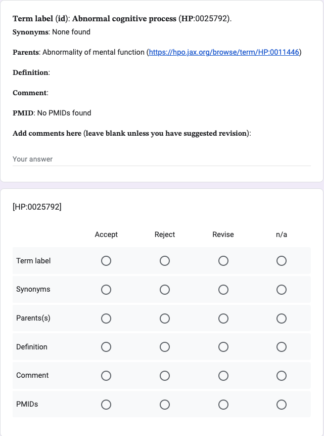

# Tutorial

This tutorial is directed at participants of HPO-Delphi processes. You will be invited by the orgqanizing team by
email that will introduce the topic and warn you that you will additionally receive emails from Google with links to 
questionnaire's (Google forms). You will receive project-specific instructions in the first email. This tutorial 
explains how to fill out the questionnaires.

Each questionnaire will ask you to enter your name and email address. Please provide the same email address and name
for all questionnaires.

## Goals

The purpose of the questionnaire is to assess whether we have consensus about new or revised HPO terms that have been 
discussed at a workshop or in another setting. The questionnaires are use to implement a modified [Delphi procedure](delphi.md).
A Delphi process can go through multiple rounds, and the goal of each round is to assess whether there is consensus about
a term and its placement in the
ontology. 

Each questionnaire will have one section per HPO term

<figure markdown>
{ width="600" }
<figcaption>Example questionnaire item.
</figcaption>
</figure>

The is one text field where you can add (1) suggestions to revise one or more of the components of the term or (2) to reject the term entirely.
Please do not add comments if you completely approve of the term and all of its components. Instead, use the radio buttons.
We will use a Python script to evaluate all of the results and will count a term as "Accepted" if the participant
chooses the "Accept" option or the "n/a" option for all components and has selected "Accept" for at least "Term label".

If you choose "Reject" for any component of a term, we will count your answer as "Reject" the entire term. Please add your rational in the text field.

If you choose "Revise" for one or more components of a term, we will count your answer as "Accept the term in principle, but it requires revisions".

After we have collected all responses to the questionnaire, we will aggregate results. Unless otherwise agreed upon, we will count
a term as "Accept in principle" if at least 70% of responses were "Accept" or "Revise". The organizing committee will implement revisions
based on all suggestions and will organize a virtual meeting to discuss them. If more than 70% of participants chose "Accept", the steering
committee will consider any suggestions, and will remove the term from future rounds if no substantial objections were raised.

If one or more participant chooses "Reject", we will discuss the rationale in the virtual meeting.

We will continue to have iterations as above until we have reached "Accept" consensus on all terms.

### Label
This is the primary term label, e.g., [Pronoun reversal](https://hpo.jax.org/browse/term/HP:4000073) is the label for term HP:4000073.
Labels should be short and comprehensible outside of the hierarchy of the HPO. For instance, [Short nose](https://hpo.jax.org/browse/term/HP:0003196)
is an acceptable label, but "Short" would not be (i.e., the label should not rely on its place in the hierarchy to infer that it is referring to "Nose").

### Synonyms
We aim to include all synonyms of a concept that are in current use. Synonyms can be exact (precise match), narrow, broad, or related (very similar concept).
If applicable, please add missing synonyms in the text field and choose the "Revise" option for this entry.

### Parents
This field indicates the placement of the term in the ontology by naming the parent or parent terms. For instance, the parent of
"Abnoral cognitive process" is [Abnormality of mental function (HP:0011446)](https://hpo.jax.org/browse/term/HP:0011446). Please 
follow the provided HTML link to the HPO webpage (it is useful to right-click on the link and open a new page!) to check the hierarchy if in doubt.
If you do not agree, please add a comment in the text field that the parent term is incorrect. If possible, suggest the correct parent term and enter
the name of the term in the text field.

### Definition
The definition should usually be one to three pithy sentences that are comprehensible not only to specialists in a medical field, but to 
physicians from other disciplines and ideally to other healthcare professionals or tranlational researchers. If you have a suggestion
to improve the definition, please choose "Revise" and enter the suggestion in the text field.

### Comment
The comment is optional. If present, it is used to provide more context, examples, or instructions as to when to use the term.
If you have a suggestion
to improve the comment, please choose "Revise" and enter the suggestion in the text field.

### PMIDs
If possible, terms should have PubMed identifiers (PMIDs) of articles that provide more in-depth explanations of a term or examples of patients or individuals diagnosed to have the 
manifestations described by the term. If you have a suggestion of a relevant PMID, please choose "Revise" and enter the suggestion in the text field.

It is acceptable to add multiple comments to the text field, which will be evaluated manually by the organizing committee.

